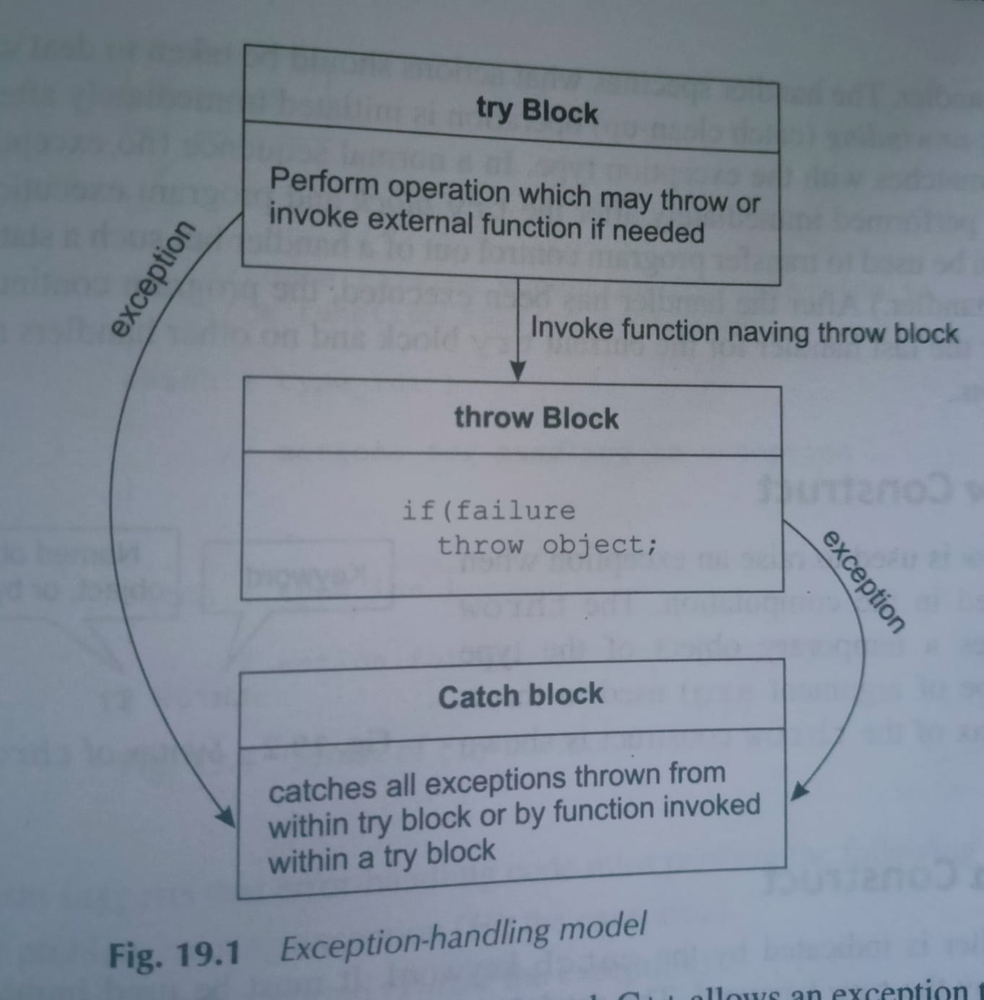

# Exception Handling

### Exception handling model

There are two types of exceptions: a)Synchronous, b)Asynchronous (i.e., exceptions which are beyond the program’s control, such as disc failure, keyboard interrupts etc.).

Exceptions provide a way to transfer control from one part of a program to another. C++ exception handling is built upon three keywords: try, catch, and throw.

**Throw** − A program throws an exception when a problem shows up. This is done using a throw keyword.

**Catch** − A program catches an exception with an exception handler at the place in a program where you want to handle the problem. The catch keyword indicates the catching of an exception.

**Try** − A try block identifies a block of code for which particular exceptions will be activated. It's followed by one or more catch blocks.